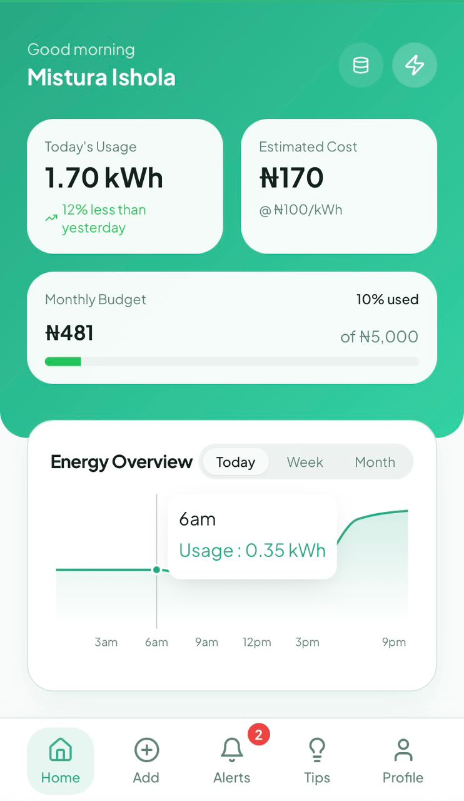
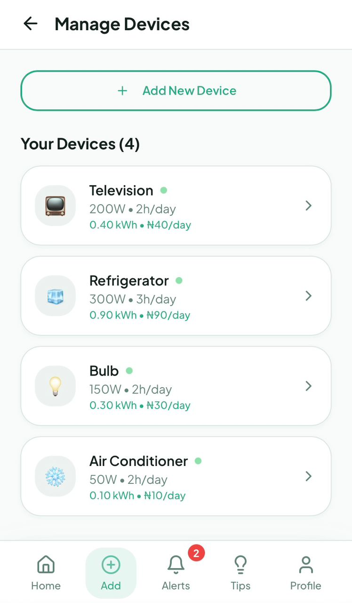
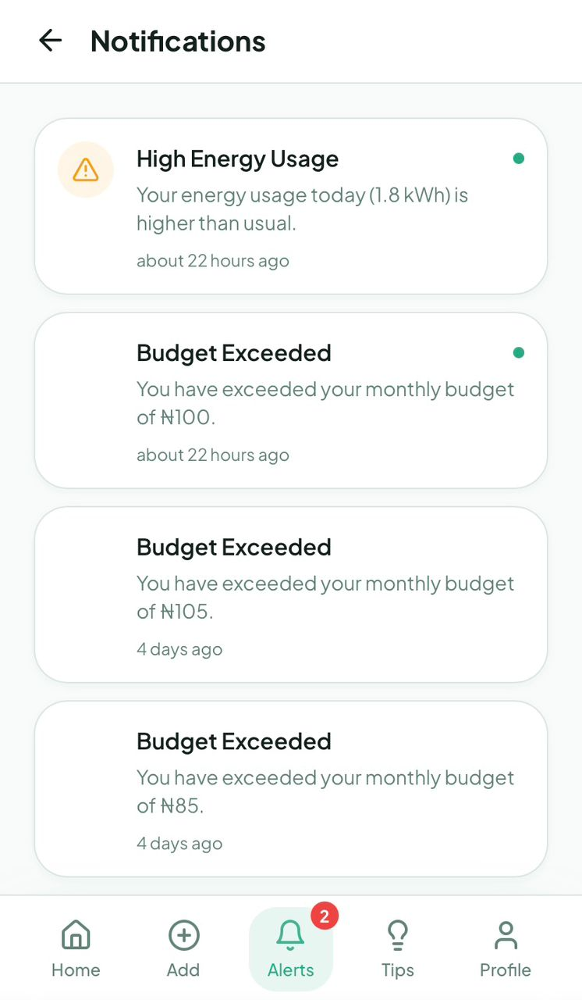
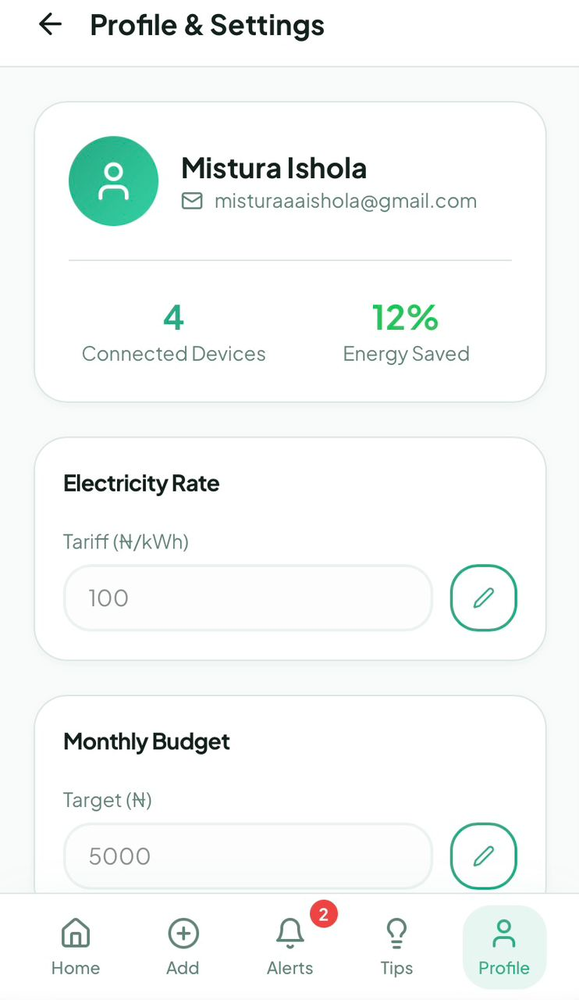
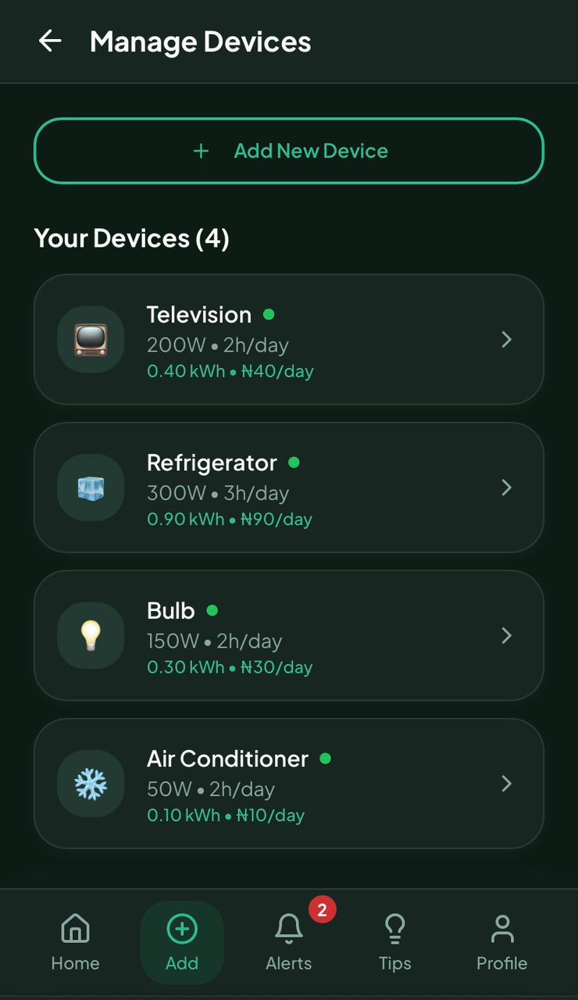

# Bright Home Energy Saver 

Bright Home Energy Saver is a smart home application that helps users monitor and optimize energy consumption. The app provides real-time insights, interactive charts and alerts, promoting efficient energy practices and helping reduce electricity costs, all through a sleek, user-friendly interface.

## Features

- **Real-time energy tracking**: View live energy consumption in your home.

- **Dashboard with charts**: Visualize your energy usage over time.

- **Efficiency tips**: Get recommendations to save energy and reduce bills.

- **Responsive design**: Works seamlessly on desktop and mobile.

- **Light/Dark mode**: Choose a theme that suits your preference.


---

## Tech Stack

- **Frontend:** React (v18), TypeScript, Vite  

- **Backend:** Supabase  

- **UI & Styling:** Tailwind CSS, Shadcn/UI, Radix UI  

- **Charts & Data Visualization:** Recharts  

- **State Management & Data Fetching:** React state/hooks, TanStack Query (React Query)  

- **Routing:** React Router DOM  

- **Forms & Validation:** React Hook Form, Zod  

- **Utilities:** date-fns, next-themes, Vite Plugin PWA  

- **Deployment:** Vercel


---

## Installation

1. **Clone the repository**
   ```bash
   git clone https://github.com/MisturaDev/bright-home-saver.git
   cd bright-home-saver
   ```

2. **Install dependencies**
   ```bash
   npm install
   ```

3. **Set up Environment Variables**
   Create a `.env` file in the root directory and add your Supabase credentials:
   ```env
    VITE_SUPABASE_URL=your_supabase_url
    VITE_SUPABASE_ANON_KEY=your_supabase_anon_key
   ```

4. **Run the development server**
   ```bash
   npm run dev
   ```

 
---


## Screenshots 

| Home Screen | Devices Screen |
|------------|----------------|
|  |  |

| Alerts Screen | Settings Screen |
|---------------|-----------------|
|  |  |


### Dark Mode

| Home | Alerts |
|------|--------|
|  |  |


---


## Developer

**Mistura Ishola**

[LinkedIn](https://www.linkedin.com/in/mistura-ishola/)


